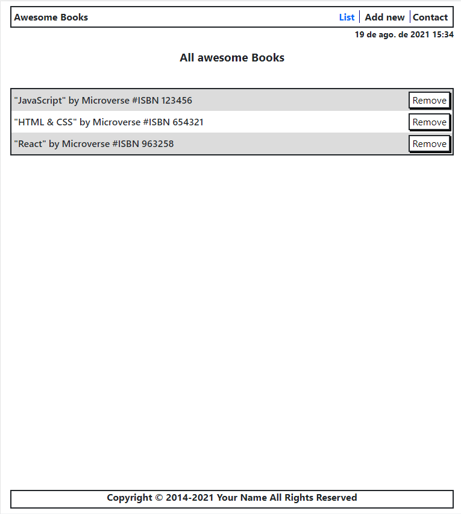

# Awesome books: plain JavaScript with objects

> In this project, I and my code partner built a basic website that allows users to add/remove books from a list. We achieve that by using JavaScript objects and arrays. Also, we use dynamically modify the DOM and add basic events.

Additional description about the project and its features.

## Built With
- HTML, CSS, JS
- Linters, Node.js, Git, Flexbox

To get a local copy up and running follow these simple example steps.
- On your terminal and run the following command to clone the repository
  
  `git clone git@github.com:leonardoeng13/capstone-module1.git`

## Live Demo

[Live Demo Link](https://livedemo.com)

## Getting Started

**This is an example of how you may give instructions on setting up your project locally.**
**Modify this file to match your project, remove sections that don't apply. For example: delete the testing section if the currect project doesn't require testing.**

To get a local copy up and running follow these simple example steps.

### Prerequisites

### Setup

### Install

### Usage

### Run tests

### Deployment

## Authors

## Authors
👤 Leonardo de Andrade

- GitHub: [@gLeonardoeng13](https://github.com/leonardoeng13)
- Twitter: [@Leo de Andrade](https://twitter.com/andrede_leo)
- LinkedIn: [Leonardo de Andrade](https://linkedin.com/in/leonardodeandrade)

👤 **Author2**

- GitHub: [@Fanger53](https://github.com/Fanger53)
- Twitter: [@DavidLe97005129](https://twitter.com/DavidLe97005129)

## 🤝 Contributing
Contributions, issues, and feature requests are welcome!

Feel free to check the [issues]https://github.com/leonardoeng13/capstone-module1/issues) page.

## Show your support

Give a ⭐️ if you like this project!

## 📝 License

This project is [MIT](./MIT.md) licensed.
